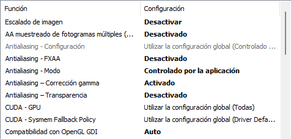
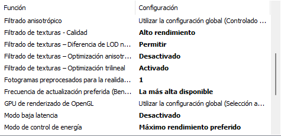
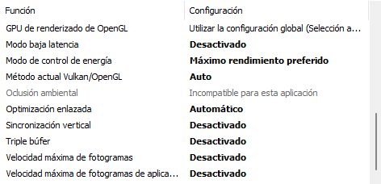
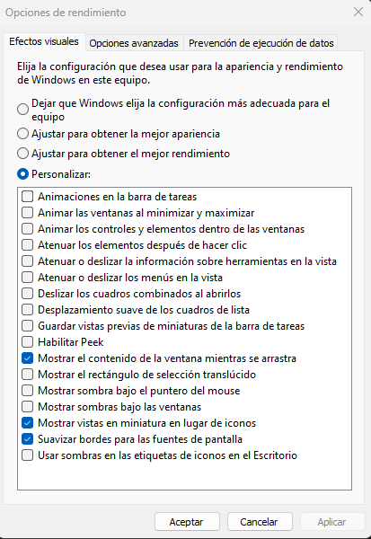
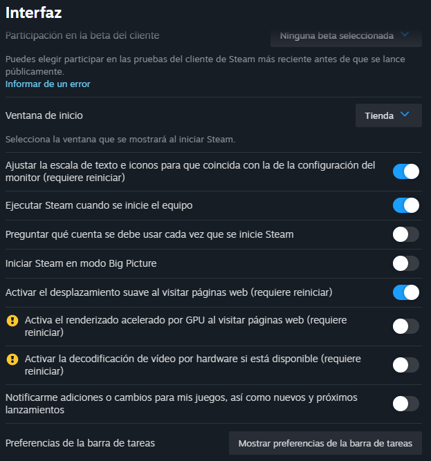
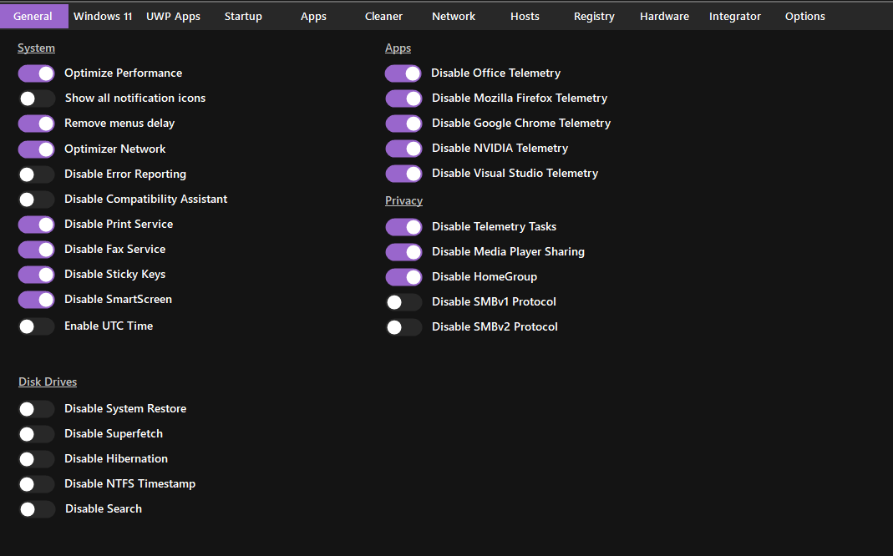
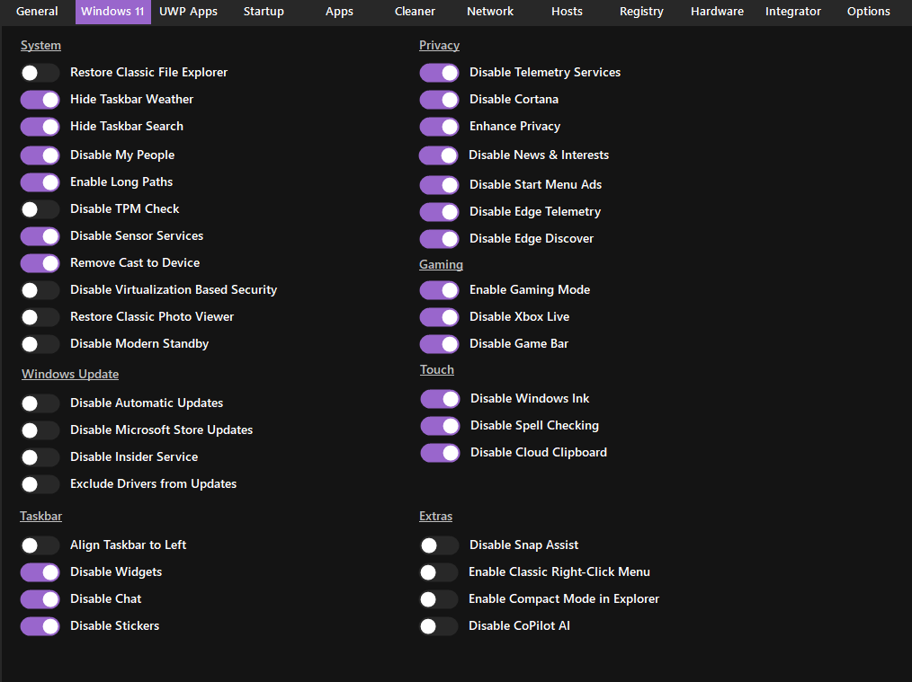
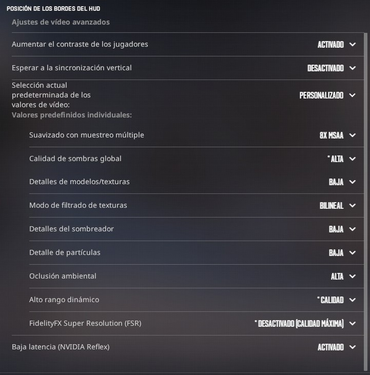

# Guía de optimización de Windows

He hecho esta guía recopilando consejos de otras guías/vídeos/tweets/comentarios de gente del mundo del CS "de fiar" (todo lo que pone aquí lo hago en el PC cada vez que formateo y nunca tuve problemas, pero por si acaso digo que **no me hago responsable de nada**). La he hecho para tener apuntado lo que yo hago, pero si le sirve a alguien pues bien para todos.

Lo he probado en portátil sin gráfica (saltándome los puntos de GPU) y **no dió resultado**.

## NVCleanStall ([link](https://www.techpowerup.com/download/techpowerup-nvcleanstall/))

1. Install the best driver for my hardware
2. Minimum
3. Marcar
	* Disable Installer Telemetry & Advertising
	* Perform a Clean Installation
	* Enable DLSS Indicator
	* Disable Multiplane Overlay
	* Disable Ansel
	* Show Expert Tweaks
		- Disable Driver Telemetry
		- Disable NVIDIA HD Audio device sleep timer
		- Enable Message Signaled Interrupts
4. Install
5. App de Nvidia
	* Aceptar
	* Instalacion personalizada
	* Instalamos

---

## Nvidia Control Panel

1. Controlar la configuracion 3D -> Configuracion globla -> Modo de control de energia -> Maximo rendimiento preferido

2. Controlar la configuracion 3D -> Configuracion de programa -> Agregar -> Examinar -> Pegar en el buscador y clickar "Abrir"

```
C:\Windows\explorer.exe
C:\Windows\System32\dwm.exe
```

3. Para los programas añadidos + los 3 de abajo -> Modo de control de energia -> Maximo rendimiento preferido
```
steam.exe
steamservice.exe
steamwebhelper.exe
```

4. CS2







---

## Rendimiento Windows

Botón derecho en Inicio -> Sistema -> Configuración avanzada de sistema -> Rendimiento -> Configuracion



---

## Optimizacion pantalla completa:
`C:\Program Files (x86)\Steam\steamapps\common\Counter-Strike Global Offensive\game\bin\win64\cs2.exe` -> Propiedades -> Compatibilidad -> Deshabilitar optimizaciones de pantalla completa

---

## Antitelemetry

Guardar el codigo de abajo en un archivo con el nombre `antitelemetry.cfg` y ejecutar.

```
@echo off
%windir%\system32\reg.exe query "HKU\S-1-5-19" 1>nul 2>nul || goto :eof
echo.
echo Anti-Telemetry blocking script
echo Some of the commands may return error(s) - you can ignore them!
reg add HKLM\SOFTWARE\Policies\Microsoft\Windows\WindowsUpdate /v DisableOSUpgrade /t REG_DWORD /d 1 /f >nul 2>&1
reg add "HKLM\SOFTWARE\Microsoft\Windows\CurrentVersion\WindowsUpdate\Auto Update" /f /v IncludeRecommendedUpdates /t REG_DWORD /d 0 >nul 2>&1
reg delete "HKLM\SOFTWARE\Microsoft\Windows\CurrentVersion\WindowsUpdate\OSUpgrade" /f >nul 2>&1
reg add HKLM\SOFTWARE\Microsoft\Windows\CurrentVersion\WindowsUpdate\OSUpgrade /v AllowOSUpgrade /t REG_DWORD /d 0 /f >nul 2>&1
reg add "HKLM\SOFTWARE\Microsoft\Windows NT\CurrentVersion\AppCompatFlags\Appraiser" /v HaveUploadedForTarget /t REG_DWORD /d 1 /f >nul 2>&1
reg add "HKLM\SOFTWARE\Microsoft\Windows NT\CurrentVersion\AppCompatFlags\AIT" /v AITEnable /t REG_DWORD /d 0 /f >nul 2>&1
reg delete "HKLM\SOFTWARE\Microsoft\Windows NT\CurrentVersion\AppCompatFlags\ClientTelemetry" /f >nul 2>&1
reg add "HKLM\SOFTWARE\Microsoft\Windows NT\CurrentVersion\AppCompatFlags\ClientTelemetry" /v DontRetryOnError /t REG_DWORD /d 1 /f >nul 2>&1
reg add "HKLM\SOFTWARE\Microsoft\Windows NT\CurrentVersion\AppCompatFlags\ClientTelemetry" /v IsCensusDisabled /t REG_DWORD /d 1 /f >nul 2>&1
reg add "HKLM\SOFTWARE\Microsoft\Windows NT\CurrentVersion\AppCompatFlags\ClientTelemetry" /v TaskEnableRun /t REG_DWORD /d 1 /f >nul 2>&1
reg delete "HKLM\SOFTWARE\Microsoft\Windows NT\CurrentVersion\AppCompatFlags" /v UpgradeEligible /f >nul 2>&1
reg delete "HKLM\SOFTWARE\Microsoft\Windows NT\CurrentVersion\AppCompatFlags\Appraiser" /f >nul 2>&1
reg delete "HKLM\SOFTWARE\Microsoft\Windows NT\CurrentVersion\AppCompatFlags\TelemetryController" /f >nul 2>&1
reg add HKLM\SOFTWARE\Microsoft\SQMClient\IE /v CEIPEnable /t REG_DWORD /d 0 /f >nul 2>&1
reg add HKLM\SOFTWARE\Microsoft\SQMClient\IE /v SqmLoggerRunning /t REG_DWORD /d 0 /f >nul 2>&1
reg add HKLM\SOFTWARE\Microsoft\SQMClient\Reliability /v CEIPEnable /t REG_DWORD /d 0 /f >nul 2>&1
reg add HKLM\SOFTWARE\Microsoft\SQMClient\Reliability /v SqmLoggerRunning /t REG_DWORD /d 0 /f >nul 2>&1
reg add HKLM\SOFTWARE\Microsoft\SQMClient\Windows /v DisableOptinExperience /t REG_DWORD /d 1 /f >nul 2>&1
reg add HKLM\SOFTWARE\Microsoft\SQMClient\Windows /v CEIPEnable /t REG_DWORD /d 0 /f >nul 2>&1
reg add HKLM\SOFTWARE\Microsoft\SQMClient\Windows /v SqmLoggerRunning /t REG_DWORD /d 0 /f >nul 2>&1
sc.exe config DiagTrack start= disabled >nul 2>&1
sc.exe stop DiagTrack >nul 2>&1
reg delete HKLM\SYSTEM\ControlSet001\Control\WMI\AutoLogger\AutoLogger-Diagtrack-Listener /f >nul 2>&1
reg delete HKLM\SYSTEM\ControlSet001\Control\WMI\AutoLogger\Diagtrack-Listener /f >nul 2>&1
reg delete HKLM\SYSTEM\ControlSet001\Control\WMI\AutoLogger\SQMLogger /f >nul 2>&1
reg delete HKLM\SOFTWARE\Microsoft\Windows\CurrentVersion\Diagnostics\DiagTrack /f >nul 2>&1
reg delete HKLM\SOFTWARE\Policies\Microsoft\Windows\DataCollection /f >nul 2>&1
reg add HKLM\SOFTWARE\Microsoft\Windows\CurrentVersion\Diagnostics\DiagTrack /v DiagTrackAuthorization /t REG_DWORD /d 0 /f >nul 2>&1
takeown /f %ProgramData%\Microsoft\Diagnosis /A /r /d y >nul 2>&1
icacls %ProgramData%\Microsoft\Diagnosis /grant:r *S-1-5-32-544:F /T /C >nul 2>&1
del /f /q %ProgramData%\Microsoft\Diagnosis\*.rbs >nul 2>&1
del /f /q /s %ProgramData%\Microsoft\Diagnosis\ETLLogs\* >nul 2>&1
schtasks /Change /TN "\Microsoft\Windows\Application Experience\Microsoft Compatibility Appraiser" /DISABLE >nul 2>&1
schtasks /Change /TN "\Microsoft\Windows\Application Experience\ProgramDataUpdater" /DISABLE >nul 2>&1
schtasks /Change /TN "\Microsoft\Windows\Application Experience\AitAgent" /DISABLE >nul 2>&1
schtasks /Change /TN "\Microsoft\Windows\PerfTrack\BackgroundConfigSurveyor" /DISABLE >nul 2>&1
schtasks /Delete /F /TN "\Microsoft\Windows\Application Experience\Microsoft Compatibility Appraiser" >nul 2>&1
schtasks /Delete /F /TN "\Microsoft\Windows\Application Experience\ProgramDataUpdater" >nul 2>&1
schtasks /Delete /F /TN "\Microsoft\Windows\Application Experience\AitAgent" >nul 2>&1
schtasks /Delete /F /TN "\Microsoft\Windows\PerfTrack\BackgroundConfigSurveyor" >nul 2>&1
TIMEOUT /T 5
```

---

## BIOS:

Desactivar HPET 
XMP profile 1

---

## Raton

Bluetooth y dispositivos -> Mouse -> Configuracion adicional del mouse -> Opciones de puntero: 
* Velocidad 6/11
* Desmarcar "Mejorar la precision del puntero"

---

## Steam

Arriba izda -> Steam -> Parametros

* Interfaz



* Notificaciones (gusto)
* Biblioteca
	- Modo de ancho de banda bajo
	- Modo de bajo rendimiento

---

## TimerResolution

1. Regedit -> `Equipo\HKEY_LOCAL_MACHINE\SYSTEM\CurrentControlSet\Control\Session Manager\kernel` -> Boton dcho -> New DWORD (32-bit) Value:
	* Nombre: `GlobalTimerResolutionRequests`
	* Valor: 1
2. Descargar [de aquí](https://github.com/amitxv/TimerResolution/releases)
	* SetTimerResolution 
	* MeasureSleeper
3. Copiar SetTimerResolution.exe a C:\
4. Boton dcho en .exe -> Mas opciones -> Crear acceso directo -> "Si" a Escritorio 
5. Windows -> Run (abrir) -> `shell:startup`
6. Arrastrar el acceso directo a la carpeta abierta
7. Boton dcho en acceso directo -> Propiedades -> Copiar `C:\SetTimerResolution.exe --resolution 5000 --no-console` en el campo "Destino" -> Aplicar y Aceptar
8. Stress test del numero "5000" subiendolo poco a poco y con el programa "MeasureSleep". El campo "delta" tiene que ser lo mas pequeño y constante posible. (Cerrar SetTimerResolution desde el admin de tareas y reabrirlo con doble click).

---

## Optimizer ([link](https://github.com/hellzerg/optimizer))





* Borrar apps al gusto

---

## Core parking

1. Regedit -> Boton dcho "HKEY_LOCAL_MACHINE" -> Buscar
2. Pegar en el campo: `0cc5b647-c1df-4637-891a-dec35c318583` -> Solo buscar en Claves -> Buscar
3. Abrir ValueMax -> Valor 0

---

## QuickCPU ([link](https://coderbag.com/product/quickcpu), ver por abajo)

-Analizar si hace algo más que crear un plan de energía.

1. Darle al 3er boton (parece la señal de internet a tope)
2. Darle debajo de "Performance" (abajo centro) a "Apply"

---

## ooshutup10 ([link](https://dl5.oo-software.com/files/ooshutup10/OOSU10.exe))

Acciones -> Aplicar solo las configuraciones recomendadas

---

## Aceleracion por Hardware

Se puede usar [esta app](https://github.com/fpsheaven/HardwareAccelerationChecker)

1. Google Chrome: ... -> Configuracion -> Sistema -> Desmarcar "Usar la aceleracion de graficos cuando este disponible"

2. Spotify: ... -> Editar -> Preferenciar -> Compatibilidad -> Desactivar "Habilitar aceleracion por hardware"

3. Discord: Ajustes de usuario - Avanzado -> Deshabilitar "Aceleracion por hardware"

---

## Nvidia Profile Inspector ([link](https://dl.nvidiaprofileinspector.com/nvidiaProfileInspector%25202.3.0.13.zip&v=2V6Ivfqw8ww))

1. Profiles -> Counter-Strike 2
2. Sync and Refresh 
	* Prefered Refreshrate -> Highest available
	* Vertical Sync -> Force off
3. Texture Filtering
	* Quality -> High performance
4. Common
	* CUDA - Force P2 State -> Off
	* Power management mode -> Prefer maximum performance
5. Arriba dcha -> Apply changes

---

## ADWCleaner ([link](https://downloads.malwarebytes.com/file/adwcleaner))

1. Analizar
2. Cuarentena

---

## Performance

1. Abrir cmd.exe como administrador
2. Ejecutar estos comandos:
```
bcdedit /set useplatformclock false
bcdedit /set tscsyncpolicy legacy
bcdedit /set disabledynamictick no
```

---

## Controlador USB

1. Abrir administrador de dispositivos
2. Desplegar Contropladoras de bus serie universal
3. En los "Concentrador raiz USB": Propiedades -> Administracion de energia -> Desactivar "Permitir que el equipo apague este dispositivo para ahorrar energia"

---

## Barra de juego

Configuracion-> Juegos -> Game Bar -> Desactivar

---

## Modo de Energia

1. Abrir cmd -> `powercfg -duplicatescheme e9a42b02-d5df-448d-aa00-03f14749eb61`
2. Windows -> Elegir un plan de energia -> Maximo rendimiento

---

## CS2

1. Audio
	* Perfil de EQ: __Nitido__
	* Aislamiento estereo: __50%__
	* _Streamlined push to talk_: __yes__

2. Video



3. FPSs
	* `fps_max 0`
	* `fps_max_ui 0`
	* `fps_max_tools 0`